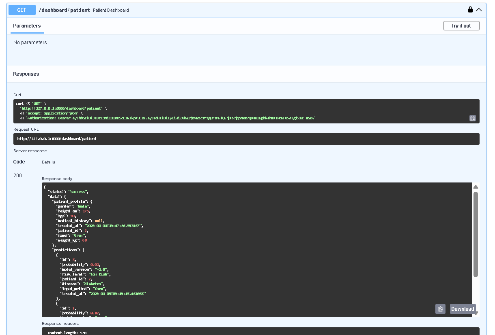
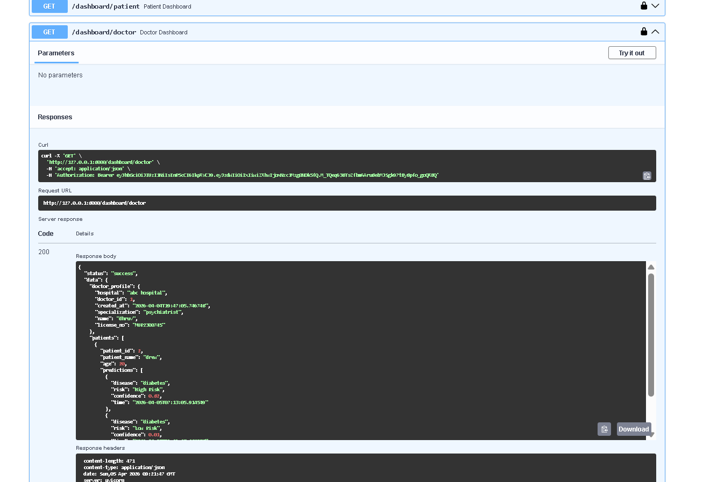

# Optimized Disease Prediction System

## Overview
A backend system built with FastAPI that enables role-based access for doctors and patients, integrates machine learning models for disease prediction, and maintains patient history with intelligent duplicate filtering.

## Features
- Role-based authentication (Doctor & Patient)
- ML-powered disease prediction
- Smart duplicate prediction filtering
- Patient history tracking (latest-first)
- Doctor dashboard with assigned patients
- Clean and consistent API response structure

## Project Structure

- app/auth → authentication logic
- app/core → main application logic
- app/ml → machine learning models
- app/services → business logic

## How to Run

1. Start PostgreSQL (Docker)
docker exec -it health-postgres psql -U health_user -d health_db

2. Run FastAPI server
uvicorn main:app --reload

3. Open Swagger UI
http://127.0.0.1:8000/docs

## Screenshots

### FastAPI

### Patient Dashboard

### Doctor Dashboard

## Example response
{
    "status" : "success",
    "data": {
        "risk": "High Risk",
        "confidence": 0.82
    }
}

## Tech Stack

- FastAPI
- PostgreSQL (Docker)
- SQLAlchemy
- Scikit-learn
- Python

## Status
Completed (Backend) - Further improvements planned

